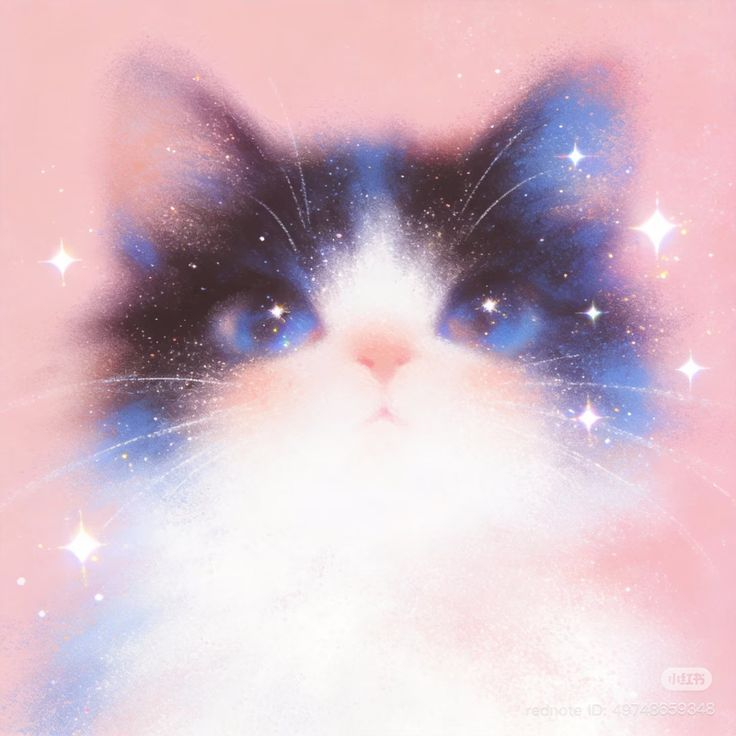

<h1><i>Hola, </i> soy Michi!</h1>
 

<h2> ꫂ᭪݁.   Acerca de mí </h2>
<ul>
<li> Ingeniera en <i> Robótica Computacional </i> desde 2024. </li>
<li> Estudiante de <i> Desarrollo de Software e Innovación en Negocios Digitales </i> </li>
<li> Secretaria y miembro de la rama estudiantil de <i> IEEE </i> en el Tecnológico de Software. </li>
</ul>

<h2> 𖦹.   Tecnologías </h2>

<table>
<tr>
<td>
 </td>
<td>

<b>Python</b>

</td>
</tr>
<tr>
<td>
 </td>
<td>

<b>Java</b>

</td>
</tr>
<tr>
<td>
 </td>
<td>

<b>Git</b>

</td>
</tr>
<tr>
<td>
 
</td>
<td>

<b>MySQL</b>

</td>
</tr>
<tr>
<td>

</td>
<td>

<b>MariaDB</b>

</td>
</tr>
<tr>
<td>

</td>
<td>

<b>Linux</b>

</td>
</tr>
<tr>
<td>

</td>
<td>

<b>Arduino</b>

</td>
</tr>
<tr>
<td>

</td>
<td>

<b>.NET</b>

</td>
</tr>
<tr>
<td>

</td>
<td>

<b>Amazon AWS</b>

</td>
</tr>
</table>

<h2>✧. Certificaciones </h2>

 

<h2>✿. Experiencia Profesional </h2>
<ul>
<li> Data Services Associate - <i> Boldr Impact</i> (2024 - Actual) </li>
<li> Quality Assurance - <i> Scale AI </i> (2022-2024) </li>
</ul>

<h2> 𖥔. Proyectos </h2>
<ul>
<li> Sistema de Monitoreo de Refrigeración - UNAM </li>
<li> Aplicación Web para la gestión de servicios con .NET Core 10 / SQL / AWS EC2 - Transportes GGP </li>
<li> Facemask Detection - Python / OpenCV </li>
<li> Conecta 4 MinMax and Alpha-Beta - Python </li>
<li> Market Backend - Programación Aplicada - Spring Boot </li>
</ul>

<h2> Gracias por tu interés en mi perfil. </h2>

